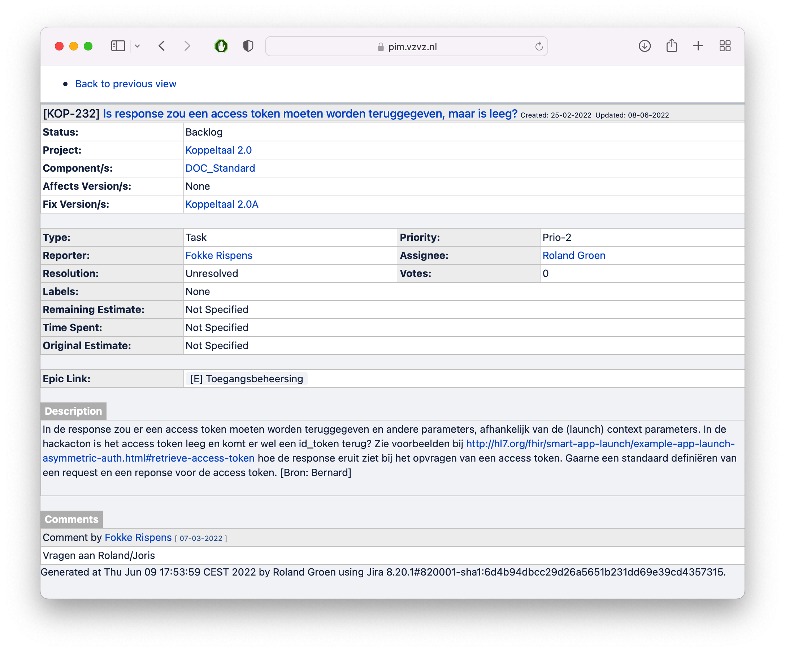
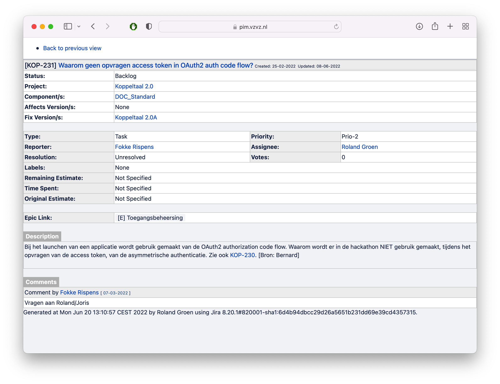

# Memo

## Advies technische kopgroep leveranciers koppeltaal 2.0 inzake de koppeltaal launch

### Aanwezig
Jan-Wijbrand Kolman, Theo Stolker, Joris Scharp en Roland Groen

## Inleiding

In de meeting KT 2.0 leveranciers tech meetup d.d. 2 jun. 2022 is ter agenda gekomen de review van het rapport ‘Review HTI/SmartHTI’ van Remco Schaar. Hieruit concluderen de leveranciers dat:

* HTI bevat geen kritieke punten die insecure zijn, afgezien van verbeteringen in de specificatie, en,
* wat ons betreft is HTI veilig om te gebruiken binnen KT2.

Als tweede punt is ter tafel gekomen de vraag hoe naar de koppeltaal 2.0 launch te kijken in relatie tot het rapport en de bevindingen tot nu toe. In deze memo worden deze bevindingen besproken.

## Bevindingen leveranciers

### Het gebruik van SMART on FHIR backend services voldoet.

De SMART backend service wordt gebruikt om de applicaties in het domein te authenticeren en autoriseren op de koppeltaal FHIR resource service. Deze voldoet aan de verwachting. Hoewel het gebruik van client assertion wat voeten in de aarde heeft, werkt het zodra het goed is opgezet. Het gebruik van SMART on FHIR application launch is een mismatch.

### Het gebruik van SMART on FHIR application launch is een mismatch.

SMART on FHIR application launch is verwarrend omdat SMART on FHIR application launch bedoeld is om in de context 
van de ingelogde gebruiker toegang tot de resource service te geven. In koppeltaal is de toegang tot de resource 
server op applicatieniveau geregeld. De access_token aan het eind van de SMART on FHIR procedure heeft dan ook geen 
functie. In de referentie implementatie wordt deze met de waarde “NOOP” gevuld, hetgeen nog meer [vragen](#appendix-a) 
oproept. Dit brengt ons tot de conclusie dat het voor ons als kopgroep leveranciers deze oplossingsrichting niet goed uitlegbaar is aan onze collega’s.

### SMART on FHIR application launch werkt niet OOTB.

Omdat de context van de launch (wie, welke module etc) beschikbaar moet zijn in de authorization service, zal er hoe dan ook de SMART on FHIR application launch voorzien moeten worden van een custom oplossing die niet onderdeel is van de SMART on FHIR application launch specificatie. SMART HTI on FHIR is hier een voorbeeld van.

### Mix van SMART on FHIR app launch een HTI (SMART HTI on FHIR) levert niet wat we verwachtten.

De oplossing die we als compromis hebben bedacht blijkt in de praktijk niet intuïtief te werken. In plaats van best of both worlds is het ‘worst of both worlds’. Genoemde punten zijn:

1. Verschillende ‘routes’ om de launch te ontvangen maakt de standaard complex te implementeren, testen en onderhouden.
2. De platform leverancier moet altijd HTI implementeren alvorens een launch uit te voeren.
3. Voor de module kan gebruik gemaakt worden van token introspection of SMART application launch. Deze keuze is:
    1. Op zich ook weer verwarrend, manieren om hetzelfde te doen.
    2. SMART app launch is ‘by itself’ ook verwarrend (zie eerdere punt).
4. Door de afwijkingen kan er geen gebruik gemaakt worden van standaard bibliotheken.

### Voor leveranciers die wensen bij internationale standaarden aan te sluiten heeft de toepassing van SMART app launch framework in Koppeltaal 2.0 geen voordelen

Omdat de standaard hoe dan ook afwijkt. Of door de context via HTI door te geven, of door de context op een andere manier door te geven, moet er hoe dan ook een custom implementatie worden gemaakt. De observatie is dat er op dit moment geen algemene standaard actief is waarmee een launch kan worden uitgevoerd en dat er per geografisch gebied andere oplossingen van kracht zijn.

### De leveranciers hebben sterk de voorkeur dat HTI niet gebruik maakt van het FHIR Task resource.

Zie hiervoor [issue #18](https://github.com/GIDSOpenStandaarden/GIDS-HTI-Protocol/issues/18) op github.

De door Remco Schaar benoemde punten in de specificatie van de standaard moeten geadresseerd worden.

De punten in het rapport ‘Review HTI/SmartHTI’ van Remco Schaar dienen, waar mogelijk en redelijkerwijs doenbaar, doorgevoerd te worden.

## Conclusies

De conclusies uit het bovenstaande zijn de volgende:

1. Maak geen gebruik van SMART on FHIR app launch framework of SMART HTI on FHIR, focus enkel op HTI.
2. Maak gebruik van token inspection voor de validatie van de HTI token.

De leveranciers geven dus als advies dat HTI de weg voorwaarts is; hiermee wordt de koppeltaal standaard eenduidig, eenvoudig en goed en snel te implementeren. Verder sluit  dit aan bij het advies van het informatieberaad om HTI niet als losse bouwsteen aan te zien, maar als onderdeel van andere standaarden verder te ontwikkelen. Verder zien we hiermee geen afwijking van het advies van het bestuur om zowel HTI als SMART on FHIR te beproeven. We hebben het beproefd en komen tot de conclusie dat SMART on FHIR verwarring bij de ontwikkelaars creëert omdat de intentie van de standaard, het persoonlijk toegang geven tot een FHIR resource server, niet overeenkomt met het gebruik van de standaard; het starten van een module.

## Appendix A

Voorbeeld van de verwarring rond de access_token zonder functie. 

